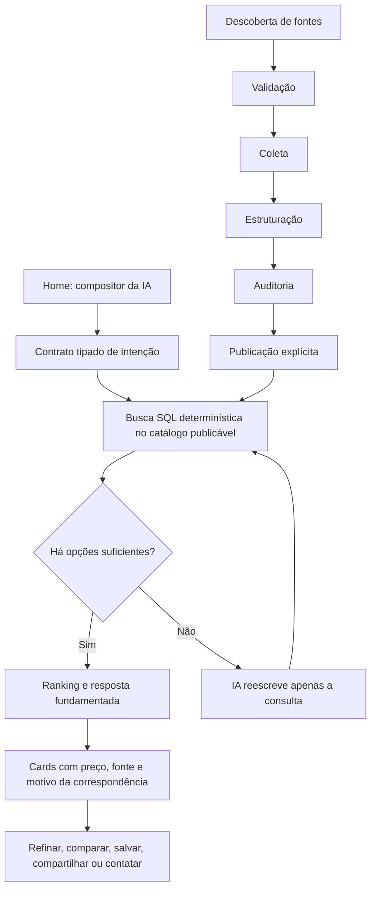

# Plano de implementação — Home congruente com a “IA dos cardápios”

**Projeto:** FilterFood  
**Data-base da auditoria:** 13 de julho de 2026  
**Escopo:** `/home`, busca de pratos, assistente, navegação do cliente, onboarding e coerência com `/landing`  
**Resultado pretendido:** transformar a home de uma vitrine genérica de restaurantes em uma experiência cujo núcleo é perguntar, receber opções comprováveis de cardápios reais, refinar e agir.

## Decisão de produto

Proposta canônica recomendada:

> **Pergunte o que você quer comer. A IA consulta cardápios reais perto de você e mostra opções que cabem na sua intenção.**

Essa frase é mais defensável do que “encontra todos os cardápios da cidade”. Ela preserva o diferencial de IA sem prometer cobertura total antes de a operação de dados conseguir comprová-la.

O trabalho primário da home passa a ser:

1. entender a intenção — prato, orçamento, pessoas, ocasião, restrições e localização;
2. consultar somente cardápios publicáveis e rastreáveis;
3. explicar por que cada opção corresponde ao pedido;
4. permitir refinar, comparar, salvar, compartilhar ou contatar o restaurante.

Não faz parte deste redesenho transformar o FilterFood em delivery, inventar avaliações, gerar preços, reservar mesas ou inferir que um item serve determinado número de pessoas sem evidência.

## ALERTA DE EFICIÊNCIA

Interpretar “30 etapas” como 30 versões visuais sequenciais da mesma tela seria caro e manteria o problema técnico intacto. O método recomendado é executar 30 incrementos cumulativos, agrupados por gates de decisão.

| Critério | Método literal: 30 revisões visuais | Método recomendado: 30 incrementos cumulativos |
|---|---|---|
| Objetivo real | Aparência progressivamente diferente | Produto progressivamente mais verdadeiro, útil e mensurável |
| Tempo estimado | 300–420 h apenas para as revisões visuais; depois ainda seriam necessárias cerca de 280–420 h para dados, segurança e motor | 348–516 h somadas nas etapas abaixo, com frentes paralelizáveis, mais coleta operacional e 7–14 dias de observação |
| Custo estimado | `(580–840 h × taxa da equipe) + operação + infraestrutura`, porque a base funcional seria corrigida depois da UI | `(348–516 h × taxa da equipe) + operação de catálogo + infraestrutura + IA`; o custo variável da IA tende a ser pequeno e será medido |
| Custo por resultado útil | Indeterminado; não há definição nem telemetria | `(engenharia do experimento + IA + infraestrutura) / buscas aprovadas no piloto` |
| Confiabilidade | Baixa: a tela pode continuar mostrando dados fictícios e resultados vazios | Alta: catálogo elegível, proveniência, testes e feature flag |
| Escala | Baixa: mais cidades ampliam mocks, lacunas e inconsistências | Gradual por região, condicionada a cobertura e qualidade |
| Bloqueios | Descobertos tarde, após o redesenho | Expostos cedo: publicação, RLS, cobertura, recuperação e latência |
| Manutenção | Parsers, telas e fallbacks duplicados | Contrato único de intenção, serviço único de busca e componentes reutilizáveis |

As estimativas de cada etapa totalizam **348–516 horas de trabalho especializado**; isso não significa a mesma duração de calendário, porque catálogo/operação, backend e UX/frontend podem avançar em paralelo depois de seus respectivos gates. O tempo de coleta varia conforme acesso e qualidade das fontes e, por honestidade, não está escondido dentro das horas de engenharia.

Marcos realistas:

- **Protótipo interno honesto:** ao concluir a etapa 15.
- **Build funcional completo para QA:** ao concluir a etapa 27.
- **Piloto real:** começa na etapa 28 e dura no mínimo 7–14 dias.
- **Candidato a produção:** somente após concluir as etapas 29 e 30.

## Evidências que determinam a ordem

### Código atual

- A promessa central da landing está em `src/pages/LandingPage.tsx:428-433`.
- A home contém vitrines estáticas de cardápios e pratos em `src/pages/Home.tsx:71-130`, além de uma nota fabricada a partir do ID em `src/pages/Home.tsx:168-171`.
- O campo principal da home apenas navega para a busca convencional em `src/pages/Home.tsx:243-253`; o botão com microfone não implementa voz em `src/pages/Home.tsx:390-397`.
- O hook de restaurantes substitui erro **e resultado vazio** por restaurantes fictícios em `src/hooks/useNearbyRestaurants.ts:56-140`.
- O assistente repete esse fallback em `src/components/AiChatBalloon.tsx:87-127`.
- O “chat de IA” de consumo usa regex e heurísticas em `src/components/AiChatBalloon.tsx:130-207` e `src/utils/comboParser.ts:67-150`; não há conversa semântica real nesse fluxo.
- O gerador de combos injeta bebidas que não constam do cardápio em `src/utils/comboParser.ts:212`, `:257`, `:307` e `:335`.
- A OpenAI é usada hoje somente como fallback de reescrita quando a busca retorna poucos itens, em `src/hooks/useSearchItems.ts:169-193` e `supabase/functions/rewrite-search-query-ai/index.ts:85-140`.
- O tour promete regras que não correspondem ao runtime — limite diário e desbloqueio por convite — em `src/components/onboarding/FeatureTour.tsx:19-51`.
- A página legal afirma que há RLS robusto em `src/components/LegalContent.tsx:97-98`, o que contradiz o estado remoto atual.

### Snapshot somente leitura do Supabase

No projeto `gaawiewmlhorzbaixoqo`, às **21:09:39 UTC de 13/07/2026**:

| Indicador | Estado atual |
|---|---:|
| Restaurantes totais | 9.016 |
| Restaurantes ativos, não excluídos | 8.414 |
| Restaurantes publicados | **0** |
| Restaurantes ativos com ao menos um item de cardápio | 110 |
| Itens ativos e com preço | 5.026 |
| Restaurantes com `menu_status = found` | 31 |
| Opções de item pesquisáveis | 4.694 |
| Itens com componentes de combo estruturados | 375 |
| Itens com `serves_count` preenchido | **0** |
| João Pessoa: ativos / com cardápio | 6.295 / 17 |
| Campina Grande: ativos / com cardápio | 1.912 / 64 |
| Cabedelo: ativos / com cardápio | 206 / 29 |

Como as duas RPCs públicas exigem `is_published = true`, o catálogo real retorna zero resultado neste estado. A home mostrada na captura é, portanto, sustentada pelos fallbacks fictícios.

Também há **16 tabelas públicas com RLS desativado**, incluindo `restaurants`, `menu_categories`, `menu_items`, `menu_item_options` e `menu_option_groups`. Pior: os papéis `anon` e `authenticated` têm grants de `INSERT`, `UPDATE`, `DELETE` e `TRUNCATE`, entre outros, nas sete tabelas centrais auditadas. O advisor remoto registra cinco erros externos do tipo “policy exists, RLS disabled”. Isso é um bloqueio de segurança anterior ao piloto. Não se deve simplesmente habilitar RLS em produção sem políticas, pois isso pode bloquear o aplicativo; a etapa 3 primeiro testa políticas e revoga privilégios excessivos em ambiente controlado. Consulte a [orientação oficial de RLS do Supabase](https://supabase.com/docs/guides/database/postgres/row-level-security).

## Arquitetura-alvo

A IA não será autorizada a inventar restaurante, prato, preço, avaliação, economia, disponibilidade ou tamanho da porção. Ela pode interpretar ou reescrever a intenção; os fatos apresentados ao usuário vêm do catálogo elegível.

## Regras econômicas da IA

O serviço existente com `gpt-4o-mini` é adequado para **reescrita curta e estruturada**, não para ser a fonte dos fatos. O preço oficial consultado em 13/07/2026 é US$ 0,15 por 1 milhão de tokens de entrada e US$ 0,60 por 1 milhão de tokens de saída: [documentação oficial](https://developers.openai.com/api/docs/models/gpt-4o-mini).

- **Método recomendado:** SQL/parser local primeiro; IA somente quando a primeira consulta tiver baixa recuperação.
- **Alternativa mais barata:** parser e sinônimos determinísticos, com custo de modelo igual a zero por consulta.
- **Alternativa mais confiável:** recuperação determinística + esquema estrito + validação contra IDs reais; um modelo maior só entra se o conjunto de avaliação provar ganho líquido.
- **Limitação:** a reescrita pode remover ou acrescentar sentido indevido; por isso toda saída deve ser validada e nunca produzir fatos de cardápio.
- **Teste pequeno:** 100 consultas douradas offline, seguido de canário de 1.000 buscas no máximo.
- **Batch:** útil apenas para avaliações offline; a busca ao vivo precisa de resposta interativa.
- **Exemplo de custo, não orçamento:** com 500 tokens de entrada e 100 de saída, uma chamada custaria cerca de US$ 0,000135. Se apenas 20% de 10 mil buscas chamarem a IA, seriam aproximadamente US$ 0,27 em modelo, antes de infraestrutura. O sistema deverá registrar os tokens reais, não assumir esse exemplo.

---

# As 30 etapas cumulativas

## Bloco 1 — Verdade de produto e catálogo

### 01. Fixar o contrato de produto e a métrica norte

- **Melhora sobre:** o diagnóstico atual, que identifica a incoerência mas ainda não define sucesso.
- **Implementação:** registrar a proposta canônica, cinco intenções prioritárias (`prato`, `orçamento`, `grupo`, `restrição`, `ocasião`) e os não objetivos. Definir como métrica norte a porcentagem de buscas em que ao menos uma opção do top 3 é considerada útil e comprovável.
- **Aceite:** landing, home, tour e backlog usam a mesma frase; qualquer funcionalidade nova pode ser ligada a uma das cinco intenções; nenhuma tarefa usa “parecer IA” como critério.
- **Responsáveis/esforço:** Produto + Tech Lead, 4–6 h.

### 02. Transformar o estado atual em baseline verificável

- **Melhora sobre a etapa 01:** substitui opinião por evidência comparável.
- **Implementação:** congelar capturas, inventário de alegações, mapa de arquivos, contagens do catálogo, 30 buscas manuais e tempos atuais. Separar descoberta, validação, coleta, estruturação, auditoria e publicação no relatório.
- **Aceite:** baseline versionado com resultado, erro, latência e origem de cada busca; todas as promessas visíveis são classificadas como comprovada, parcial ou falsa.
- **Responsáveis/esforço:** Produto + QA + Dados, 6–8 h.

### 03. Fechar o Gate 0 de segurança

- **Melhora sobre a etapa 02:** corrige imediatamente o risco mais grave revelado pelo baseline, antes de qualquer trabalho de publicação ou piloto.
- **Implementação:** testar RLS primeiro em branch/staging; revogar `INSERT`, `UPDATE`, `DELETE`, `TRUNCATE`, `TRIGGER` e `REFERENCES` de `anon`/`authenticated` onde não forem estritamente necessários; permitir leitura somente da projeção pública; reservar mutações para proprietário, admin ou service role; revisar `SECURITY DEFINER`, `search_path`, grants das RPCs e funções Edge. Criar testes de acesso anônimo, cliente, proprietário e admin; ajustar a declaração legal até que ela corresponda ao estado comprovado.
- **Aceite:** usuário anônimo não altera nenhuma tabela nem lê não publicados; cliente não altera restaurante alheio; proprietário altera somente o próprio; worker server-side continua operando; advisories críticos do escopo chegam a zero. Nenhum `ALTER TABLE ... ENABLE RLS` é aplicado em produção sem políticas já testadas, e rollback nunca significa desligar RLS outra vez.
- **Responsáveis/esforço:** Backend + Segurança + QA, 16–24 h.

### 04. Isolar demos e eliminar ficção do runtime de produção

- **Melhora sobre a etapa 03:** acrescenta integridade de produto à base já protegida.
- **Implementação:** remover os fallbacks automáticos, `ratingFromId`, vitrines estáticas e bebidas injetadas dos caminhos de produção. Fixtures só podem aparecer em desenvolvimento local ou sob `VITE_DEMO_MODE=true`, com rótulo visível “demonstração” no bloco e em cada item; nunca entram como fallback silencioso de uma consulta real. Erro, vazio e ausência de cobertura tornam-se estados diferentes.
- **Aceite:** build de produção não apresenta nenhum ID `mock-*`, nome, nota, preço ou item fictício; desligar a rede resulta em recuperação explícita, nunca em restaurante simulado.
- **Responsáveis/esforço:** Frontend + Backend + QA, 12–16 h.

### 05. Criar o contrato de elegibilidade do catálogo público

- **Melhora sobre a etapa 04:** transforma o runtime honesto, porém vazio, em um sistema capaz de dizer exatamente o que falta para publicar.
- **Implementação:** criar uma view/consulta de prontidão com motivo de bloqueio por restaurante. Requisitos mínimos: não excluído, geocodificado, `menu_status=found`, `ai_validated=true`, categoria e item ativos/pesquisáveis, preço comercial válido, fonte/proveniência, contato oficial e auditoria aprovada. `is_published` continua sendo o gate explícito final.
- **Aceite:** todo restaurante aparece como elegível ou com lista determinística de pendências; as contagens reconciliam com as tabelas de origem; busca pública só consulta elegíveis publicados.
- **Responsáveis/esforço:** Backend/Dados, 12–18 h.

## Bloco 2 — Piloto real e motor de busca

### 06. Escolher uma micro-região de piloto por densidade, não por desejo

- **Melhora sobre a etapa 05:** aplica o catálogo seguro em um recorte onde é possível obter utilidade real rapidamente.
- **Implementação:** comparar densidade de menus, distância entre estabelecimentos e demanda. Cabedelo é hoje o candidato de menor esforço relativo (29 cardápios entre 206 ativos); Cabo Branco/João Pessoa deve ser escolhido apenas se o valor estratégico compensar a coleta adicional. Fixar raio, coorte de 25–40 restaurantes e 50 intenções locais.
- **Aceite:** uma única região, raio e lista nominal aprovados; cada candidato tem dono operacional e status; nenhuma promessa é ampliada para a cidade inteira.
- **Responsáveis/esforço:** Produto + Operações + Dados, 6–10 h.

### 07. Levar a coorte até publicação por gates explícitos

- **Melhora sobre a etapa 06:** converte seleção em cobertura utilizável.
- **Implementação:** para cada candidato, executar sequencialmente descoberta de fonte, validação, coleta, estruturação, auditoria e publicação. Registrar fonte, data da última verificação, confiança e responsável. Não publicar automaticamente ao encontrar uma URL.
- **Aceite:** todos os 31 candidatos atuais com `menu_status=found` são revisados integralmente; pelo menos 25 menus elegíveis no raio, 500 itens pesquisáveis e 100% dos menus publicados auditados. Preço/tipo de preço e fonte devem estar corretos em 100% do que for exibido; falso positivo crítico = zero.
- **Responsáveis/esforço:** Operações + Dados + QA; 16–32 h técnicas, além do tempo de coleta.

### 08. Unificar a intenção em um contrato tipado

- **Melhora sobre a etapa 07:** permite consultar o novo catálogo com significado consistente, em vez de dois parsers divergentes.
- **Implementação:** criar `MenuSearchIntent` validado com Zod: texto livre, prato/ingredientes, orçamento mínimo/máximo, pessoas, categorias, restrições, ocasião, coordenadas/bairro, distância e ordenação. Fundir a responsabilidade de `searchParser.ts` e `comboParser.ts`; campos desconhecidos ficam `null`, sem defaults silenciosos.
- **Aceite:** o mesmo texto gera o mesmo objeto em home, busca e assistente; suíte com pelo menos 100 frases cobre acentos, valores, bairros, negações e consultas incompletas; precisão de campos críticos ≥90%.
- **Responsáveis/esforço:** Frontend + Backend + QA, 12–16 h.

### 09. Construir recuperação e ranking determinísticos

- **Melhora sobre a etapa 08:** transforma intenção estruturada em opções reais e ordenadas.
- **Implementação:** criar uma única RPC/serviço que filtre catálogo elegível, aplique de fato categoria, preço, restrição, localização e disponibilidade de campos. Ranking: correspondência exata de item; variante pesquisável; ingredientes/descrição; proximidade; qualidade/frescor da fonte. Consultas reescritas entram como array em uma única chamada ranqueada, sem até seis RPCs sequenciais. Retornar `match_reason`, `source_url`, `verified_at`, tipo de preço e IDs rastreáveis.
- **Aceite:** nenhuma entidade fora do catálogo publicado; top 3 das 50 consultas do piloto revisado manualmente; paginação estável, sem duplicatas; filtro de categoria altera materialmente o resultado.
- **Responsáveis/esforço:** Backend/Dados + QA, 18–24 h.

### 10. Usar IA apenas como fallback de recuperação controlado

- **Melhora sobre a etapa 09:** aumenta recall sem trocar fatos determinísticos por geração.
- **Implementação:** manter `rewrite-search-query-ai` somente quando a busca primária retornar menos de três opções e a intenção tiver texto suficiente. Exigir JSON estruturado, validar tokens contra a intenção, limitar corpo e texto, no máximo cinco variantes e saída curta; usar allowlist de CORS, rate limit, timeout, circuit breaker, cache por consulta normalizada e deduplicação. Fixar versão de prompt/modelo durante o piloto e retornar `usedAI`, versão, tokens, cache hit e motivo do fallback.
- **Aceite:** falha/timeout da OpenAI mantém a busca utilizável; IA nunca devolve restaurante ou preço; abuso excede quota sem consumir modelo; taxa de chamadas alvo ≤20%; uma consulta idêntica reaproveita cache; custo e latência fecham por `trace_id`.
- **Responsáveis/esforço:** Backend + Plataforma, 10–16 h.

## Bloco 3 — Provar o motor antes de redesenhar a home

### 11. Criar avaliação dourada e gate do motor

- **Melhora sobre a etapa 10:** demonstra se o fallback realmente melhora a recuperação.
- **Implementação:** montar 100–150 consultas representativas com respostas esperadas ou critérios de relevância. Medir extração de intenção, precision@3, recall@5, groundedness, acurácia de preço/fonte, falsos positivos, latência e custo. Comparar SQL puro com SQL + IA.
- **Aceite:** zero fato inventado; ≥80% das consultas com ao menos uma opção útil no top 3; preço, tipo de preço e fonte corretos em 100% dos cards auditados; fallback só permanece onde provar ganho de recall sem perda de precisão superior a 2 p.p.
- **Responsáveis/esforço:** Dados + Produto + QA, 16–24 h.

### 12. Desenhar a arquitetura de informação IA-first

- **Melhora sobre a etapa 11:** traduz um motor comprovado em uma jornada compreensível.
- **Implementação:** protótipo de baixa fidelidade com esta ordem: localização/identidade; pergunta principal; contexto; progresso da consulta; respostas; refinamentos; histórico/continuação; menus verificados próximos; ações secundárias. Categorias e vitrines deixam de disputar o primeiro scroll.
- **Aceite:** em teste com cinco pessoas, pelo menos quatro identificam em até cinco segundos que podem perguntar à IA e concluem uma busca sem instrução em até 30 segundos.
- **Responsáveis/esforço:** Produto + UX, 10–16 h.

### 13. Criar a fundação frontend sob feature flag

- **Melhora sobre a etapa 12:** converte o protótipo em arquitetura implementável sem quebrar a home atual de uma vez.
- **Implementação:** criar `features/menu-assistant/` com `types.ts`, serviço, `useMenuDiscoverySession`, serialização de URL, telemetria, máquina de estados e componentes. `HomeAiV2` entra sob feature flag; `SearchUnifiedPage` e o assistente passam a consumir a mesma sessão e o mesmo serviço. Preservar tokens globais e as alterações locais existentes na landing.
- **Aceite:** versão antiga e V2 podem ser alternadas sem deploy; nenhum parser/RPC é duplicado; navegar entre home, busca detalhada e apresentação expandida preserva intenção, localização, filtros e resultados; TypeScript compila; estado e contrato têm testes unitários.
- **Responsáveis/esforço:** Frontend, 10–14 h.

### 14. Substituir o hero por um compositor conversacional verdadeiro

- **Melhora sobre a etapa 13:** faz o primeiro viewport comunicar e executar a proposta canônica.
- **Implementação:** título “O que você quer comer?”, explicação curta sobre cardápios reais, label visível, input de texto e um único CTA “Perguntar à IA”. Sugestões devem demonstrar capacidades reais, como “Pizza para 3 até R$ 100”. Remover o microfone até existir reconhecimento de voz funcional.
- **Aceite:** o CTA executa uma consulta real; não há controle com affordance falsa; teste de cinco segundos confirma IA + cardápios + preço/localização.
- **Responsáveis/esforço:** Frontend + UX, 10–14 h.

### 15. Manter pergunta e resposta no mesmo fluxo da home

- **Melhora sobre a etapa 14:** elimina a quebra de contexto causada pelo redirecionamento para `/search` ou por um balão independente.
- **Implementação:** expandir a resposta canonicamente abaixo do compositor; uma sheet acessível pode ser apenas outra apresentação da mesma sessão em telas pequenas. O botão central da navegação volta/foca o compositor e nunca abre uma segunda IA. Persistir intenção não sensível na URL para deep link e restauração.
- **Aceite:** hero e botão central produzem estado, resultados e histórico idênticos; voltar restaura pergunta, filtros e scroll; uma consulta pode ser compartilhada sem expor dados privados.
- **Responsáveis/esforço:** Frontend, 12–18 h.

## Bloco 4 — Tornar a experiência realmente assistiva

### 16. Apresentar respostas fundamentadas, não cards genéricos

- **Melhora sobre a etapa 15:** converte a resposta bruta em decisão confiável.
- **Implementação:** card com prato/variante, preço correto (`fixo`, `a partir de`, `faixa`, `configurável`), restaurante, distância, motivo da correspondência, fonte e data de verificação. Avaliação só aparece quando houver fonte real. CTA primário: “Ver no cardápio”.
- **Aceite:** cada campo do card é rastreável por ID até o banco; snapshot e teste de contrato cobrem todos os tipos de preço; nenhuma “economia” é exibida sem comparação demonstrável.
- **Responsáveis/esforço:** Frontend + Backend + QA, 14–20 h.

### 17. Adicionar refinamento progressivo da intenção

- **Melhora sobre a etapa 16:** transforma uma busca de uma rodada em assistência útil.
- **Implementação:** ações “mais barato”, “mais perto”, “sem X”, “para N pessoas”, “outra categoria” e edição explícita de chips. Cada refinamento altera `MenuSearchIntent`, reconsulta o catálogo e mantém o contexto anterior visível.
- **Aceite:** ao menos cinco refinamentos funcionam sem redigitar a busca; remover um chip desfaz apenas aquele critério; testes garantem que negações não virem inclusões.
- **Responsáveis/esforço:** Frontend + Backend, 12–18 h.

### 18. Tratar localização e cobertura como parte da conversa

- **Melhora sobre a etapa 17:** impede refinamentos precisos sobre uma localização silenciosamente errada.
- **Implementação:** estados para permissão, GPS indisponível, endereço manual, fora da área piloto e troca de região. Remover o default silencioso de João Pessoa. Antes da busca, mostrar onde a IA está consultando e permitir editar.
- **Aceite:** negar GPS não bloqueia o app; busca manual funciona; nenhuma consulta usa coordenada default invisível; fora da cobertura mostra explicação e opção de escolher área disponível.
- **Responsáveis/esforço:** Frontend + Backend + UX, 10–14 h.

### 19. Completar a máquina de estados assíncronos

- **Melhora sobre a etapa 18:** torna falhas e espera recuperáveis, sem mascará-las.
- **Implementação:** estados `idle`, `locating`, `checking_coverage`, `parsing`, `searching`, `rewriting`, `partial`, `success`, `no_result`, `no_coverage`, `stale`, `offline`, `cancelled` e `error`. Debounce, cancelamento de requisição obsoleta, skeleton após 300 ms, `aria-live`, retry contextual e mensagens que distinguem critério não satisfeito, dado inexistente, dado antigo e falha técnica.
- **Aceite:** teste automatizado cobre todas as transições e recuperações; nenhuma tela fica vazia; envio duplicado não cria duas consultas; resultado parcial declara o filtro relaxado; offline só usa cache rotulado com fonte/data; erro de rede nunca produz dados demo.
- **Responsáveis/esforço:** Frontend + QA, 10–14 h.

### 20. Trocar vitrines estáticas por continuidade real

- **Melhora sobre a etapa 19:** preenche a home fora da sessão sem retornar ao padrão de marketplace genérico.
- **Implementação:** substituir `CITY_MENU_CARDS`, `RECOMMENDED_DISHES` e categorias decorativas por “Continue sua busca”, “Buscas recentes” e sugestões derivadas de sinais reais. Sem histórico, usar exemplos de perguntas, não restaurantes inventados.
- **Aceite:** todo conteúdo personalizado informa sua origem; usuário pode limpar histórico; conta nova não vê recomendação apresentada como pessoal.
- **Responsáveis/esforço:** Frontend + Dados, 10–14 h.

## Bloco 5 — Continuidade, coerência e qualidade de interface

### 21. Reposicionar menus próximos e Happy Hour como contexto secundário

- **Melhora sobre a etapa 20:** preserva descoberta e social sem deixá-los dominar o diferencial.
- **Implementação:** abaixo da IA, mostrar apenas “Cardápios verificados perto de você”, com motivo objetivo de ordenação. Happy Hour vira ação contextual após uma resposta ou bloco secundário compacto. Categorias podem virar prompts, não uma navegação paralela dominante.
- **Aceite:** primeiro scroll tem uma ação primária; menus próximos vêm do catálogo elegível; “recomendado” só é usado quando houver regra documentada.
- **Responsáveis/esforço:** Produto + UX + Frontend, 8–12 h.

### 22. Conectar a resposta a ações de decisão

- **Melhora sobre a etapa 21:** transforma descoberta em resultado útil mensurável.
- **Implementação:** salvar, comparar, compartilhar, traçar rota, abrir canal oficial e sugerir no Happy Hour a partir do item/restaurante encontrado. Manter o usuário no contexto e fornecer caminho de volta. Contato só usa canal validado.
- **Aceite:** cada ação funciona com deep link correto; falha de aplicativo externo tem fallback; eventos diferenciam visualização, intenção e contato — encontrar não é tratado como publicação ou conversão.
- **Responsáveis/esforço:** Frontend + Backend + QA, 12–18 h.

### 23. Alinhar navegação, onboarding, tour e landing

- **Melhora sobre a etapa 22:** elimina contradições nos demais pontos de entrada.
- **Implementação:** dar rótulo perceptível ao centro da bottom nav (“Perguntar”); reescrever o tour sem emojis estruturais, limite diário falso ou convite inexistente; fazer CTA da landing abrir o compositor; rotular demo ilustrativa; retirar “todos os cardápios” enquanto não houver denominador auditável.
- **Aceite:** matriz de copy não encontra promessas conflitantes; landing → autenticação → home mantém o mesmo job-to-be-done; tour ensina a primeira pergunta, não quatro produtos concorrentes.
- **Responsáveis/esforço:** Produto + Conteúdo + Frontend, 10–14 h.

### 24. Fechar acessibilidade e ergonomia móvel

- **Melhora sobre a etapa 23:** torna a experiência coerente também para teclado, leitor de tela e toque.
- **Implementação:** contraste AA, fonte de input ≥16 px, alvos ≥44×44 px, labels visíveis, ordem de foco, `aria-live` para progresso/resposta, foco restaurado ao fechar sheet, alt significativo, navegação por teclado e `prefers-reduced-motion`. Usar Lucide/SVG no lugar de emoji estrutural.
- **Aceite:** axe sem violações críticas/sérias nas telas do fluxo; execução completa por teclado; teste com leitor de tela; 200% de zoom sem perda de ação.
- **Responsáveis/esforço:** Frontend + QA de acessibilidade, 12–18 h.

### 25. Otimizar responsividade, percepção e latência

- **Melhora sobre a etapa 24:** mantém a clareza sob dispositivos e redes reais.
- **Implementação:** validar 320/375/390/448 px, tablet e landscape; safe areas; zero scroll horizontal; imagens WebP/AVIF responsivas; lazy load abaixo da dobra; divisão por rota; cache/deduplicação; animações apenas por `transform/opacity` e 150–300 ms.
- **Aceite:** CLS <0,1, INP <200 ms e LCP p75 <2,5 s no piloto; primeiro resultado determinístico p50 ≤0,8 s e p95 ≤1,5 s; fluxo enriquecido com IA p50 ≤2 s e p95 ≤3 s; taxa de erro total <1%; nenhum conteúdo escondido pela bottom nav.
- **Responsáveis/esforço:** Frontend + Plataforma + QA, 12–18 h.

## Bloco 6 — Medir, testar, pilotar e escalar

### 26. Instrumentar qualidade, funil, custo e privacidade

- **Melhora sobre a etapa 25:** torna desempenho e utilidade observáveis fora do laboratório.
- **Implementação:** eventos `home_view`, `assistant_prompt_started`, `query_submitted`, `location_resolved`, `ai_fallback_used`, `results_returned`, `result_opened`, `refinement_used`, `contact_clicked`, `no_result`, `no_coverage`, `error` e feedback útil/não útil. Registrar latência, contagem, modelo/tokens e versão do ranking; minimizar ou anonimizar texto livre conforme LGPD.
- **Aceite:** dashboard reproduz o funil; custos fecham com logs do provedor; prompts brutos não ficam em analytics por padrão; duplicatas e bots são filtrados.
- **Responsáveis/esforço:** Backend + Dados + Produto, 12–18 h.

### 27. Automatizar os contratos críticos de ponta a ponta

- **Melhora sobre a etapa 26:** impede que mudanças futuras corrompam métricas ou confiança.
- **Implementação:** unitários para parser/ranking/preço; integração para RLS, RPC e Edge Function; E2E para pergunta → resposta → refinamento → cardápio; acessibilidade; snapshots visuais em 375 e 448 px; testes de timeout, catálogo vazio e OpenAI indisponível.
- **Aceite:** CI bloqueia merge ao inventar dado, quebrar política, perder estado ou falhar nos estados principais; 100% dos ramos críticos da máquina de estados cobertos; build de produção verde.
- **Responsáveis/esforço:** QA + Frontend + Backend, 20–28 h.

### 28. Liberar um canário controlado com rollback

- **Melhora sobre a etapa 27:** troca evidência de teste por uso real sem expor toda a base.
- **Implementação:** executar três ondas por feature flag: (1) canário interno com cinco restaurantes e 100 consultas; (2) piloto fechado com 15 restaurantes, ≥30 testadores e ≥300 buscas; (3) piloto ampliado com 25–30 restaurantes e ≥1.000 buscas durante pelo menos sete dias. Monitorar P0/P1, no-result, latência, custo e feedback; rollback por flag.
- **Aceite:** cada onda passa seus gates antes da seguinte; zero P0, plano de rollback ensaiado, ≥100 avaliações explícitas e amostra manual diária; nenhum usuário fora da cobertura recebe promessa de disponibilidade.
- **Responsáveis/esforço:** Produto + Plataforma + Suporte, 8–12 h mais observação.

### 29. Melhorar ranking, copy e cobertura com dados do piloto

- **Melhora sobre a etapa 28:** converte comportamento real em correção objetiva, em vez de gosto visual.
- **Implementação:** revisar consultas sem resultado, falsos positivos, abandonos e cards ignorados; corrigir primeiro catálogo/sinônimos/ranking, depois copy; modelo maior somente se o teste A/B offline demonstrar ganho econômico. Reexecutar avaliação dourada e canário.
- **Aceite:** ≥80% das buscas com opção útil no top 3; preço, tipo de preço e fonte corretos em 100% dos cards auditados; zero fabricação; IA em ≤20% das buscas; p95 completo ≤3 s; abertura de cardápio ≥25%; custo por busca útil registrado e dentro do teto aprovado.
- **Responsáveis/esforço:** Produto + Dados + Engenharia, 16–24 h.

### 30. Fechar o gate de produção e a política de escala

- **Melhora sobre a etapa 29:** transforma um piloto aprovado em operação sustentável, sem voltar a promessas absolutas.
- **Implementação:** auditoria requisito por requisito; remover caminhos legados e feature flag apenas após estabilidade; documentar runbook, rollback, ownership, SLO e rotina de frescor. Expandir uma micro-região por vez quando houver ≥25 menus elegíveis, ≥500 itens e a avaliação local repetir os gates da etapa 29. Só usar “todos os cardápios” com denominador externo auditável e cobertura ≥95%; preferir permanentemente a proposta canônica sem absoluto.
- **Aceite:** checklist técnico, produto, dados, segurança, LGPD, acessibilidade e operação assinado; duas semanas sem regressão crítica; landing e home usam a mesma promessa; cada nova região tem gate e responsável próprios.
- **Responsáveis/esforço:** Tech Lead + Produto + Segurança + Operações, 12–18 h.

---

## Gates de decisão

| Gate | Momento | Condição mínima para avançar |
|---|---|---|
| G1 — Verdade e segurança | Após etapa 07 | Zero mocks em produção, RLS validada e ≥25 menus elegíveis no piloto |
| G2 — Qualidade do motor | Após etapa 11 | Zero fabricação, top-3 útil ≥80%, preço/tipo/fonte corretos em 100% dos cards auditados |
| G3 — Coerência da experiência | Após etapa 23 | Landing, home, tour e navegação ensinam e executam a mesma proposta |
| G4 — Produção | Após etapa 29 | KPIs do piloto, latência, custo, segurança e acessibilidade aprovados |

Se um gate falhar, corrige-se a causa dentro do bloco atual; não se “compensa” uma lacuna de dados com mais decoração ou linguagem mais enfática.

## Mapa inicial de código

| Área | Ação principal |
|---|---|
| `src/pages/Home.tsx` | decompor e substituir pela experiência IA-first sob flag |
| `src/components/AiChatBalloon.tsx` | converter em superfície reutilizável, alimentada pelo serviço único |
| `src/pages/SearchUnifiedPage.tsx` | reaproveitar filtros/cards, removendo lógica duplicada |
| `src/hooks/useNearbyRestaurants.ts` | remover mocks e consultar apenas catálogo elegível |
| `src/hooks/useSearchItems.ts` | virar hook fino sobre o serviço unificado |
| `src/context/UserSearchLocationContext.tsx` + modais de localização | representar origem/status/erro/cobertura e eliminar localização padrão silenciosa |
| `src/utils/searchParser.ts` + `src/utils/comboParser.ts` | consolidar no contrato `MenuSearchIntent` |
| `supabase/functions/rewrite-search-query-ai/index.ts` | limitar a reescrita estruturada, cachear e observar |
| Nova migration/RPC | prontidão, projeção pública, busca/ranking, RLS e eventos |
| `src/layouts/SharedLayoutWrapper.tsx` + `ClientBottomNav.tsx` | compartilhar uma única sessão do assistente |
| `src/components/onboarding/FeatureTour.tsx` | ensinar a proposta real e remover claims inexistentes |
| `src/pages/LandingPage.tsx` | alinhar copy e entrada no mesmo fluxo, preservando mudanças locais |

## Métricas do piloto

- **Resultado por minuto:** buscas concluídas / minutos do teste; também p50/p95 de latência.
- **Taxa de sucesso:** buscas com ≥1 opção útil no top 3 / buscas avaliadas.
- **Custo por resultado aprovado:** `(modelo + infraestrutura incremental + custo operacional do experimento) / buscas úteis`.
- **Falsos positivos:** opções julgadas incompatíveis / opções avaliadas.
- **Fabricação:** campos sem correspondência em fonte publicada; meta absoluta = zero.
- **Taxa de erros:** buscas 5xx, timeout ou sem resposta recuperável / buscas submetidas; meta <1%.
- **Acurácia de preço/fonte:** cards com preço, tipo de preço e fonte corretos / cards auditados; meta = 100%.
- **Conversão de decisão:** abertura de cardápio, salvar, compartilhar, rota ou contato / buscas com resultado.
- **Economia de trabalho manual:** tempo médio para obter três opções antes versus depois.
- **Cobertura:** proporção das intenções douradas atendidas, não apenas número bruto de restaurantes cadastrados.

## Ordem de execução recomendada

Não iniciar pelo redesign final de `Home.tsx`. As primeiras mudanças de produção devem ser: proteger o catálogo, remover ficção, definir elegibilidade e publicar uma coorte real. O novo visual entra depois que uma consulta real já consegue produzir uma resposta fundamentada. Essa ordem é o que torna a home congruente com a landing por capacidade, não apenas por texto.
